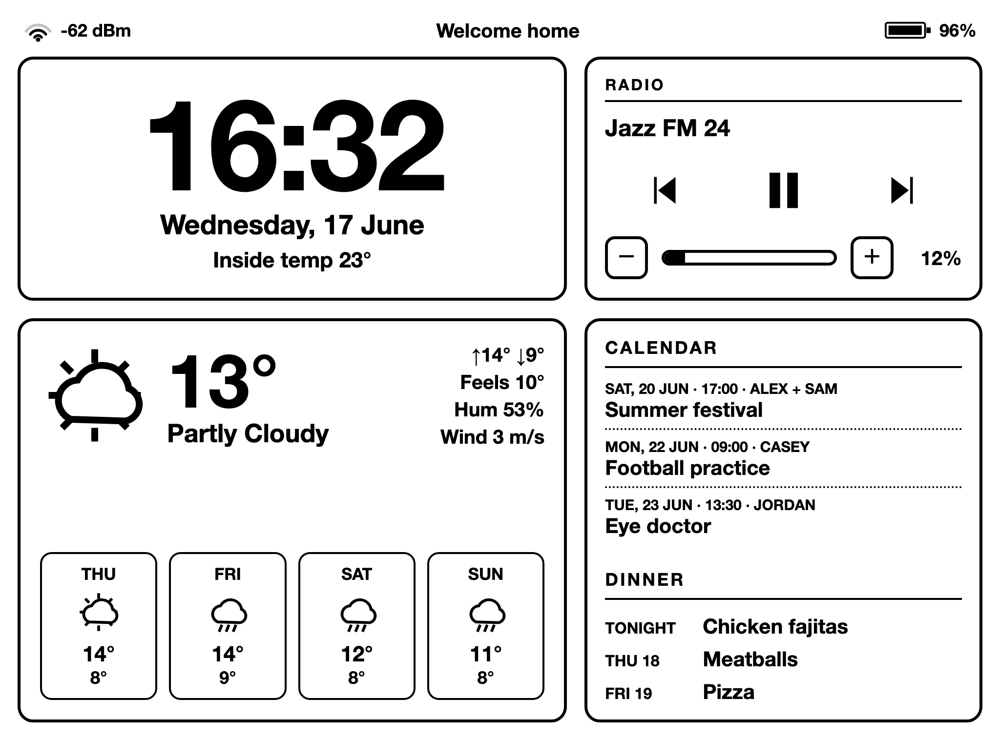

# joanboard

A self-contained e-ink dashboard for a Visionect Joan tablet, driven by Home Assistant.
It shows a clock, weather with a multi-day forecast, a merged family calendar, the dinner
plan, and radio controls. Landscape, pure black on white for e-ink.

It is just a plain HTML page you fully control, so you can lay out and render whatever you want
on the device, rather than being limited to a prebuilt dashboard system like AppDaemon's
HADashboard. Controlling the page also lets it poll the device's native telemetry (battery, WiFi
signal, inside temperature) directly from the Visionect renderer, which a prebuilt widget
dashboard cannot reach.



## How it works

The Joan cannot talk to Home Assistant directly. The Visionect Software Suite renders a URL in a
headless browser and pushes the image to the screen. This project is that URL: a static page plus
a small add-on. The add-on serves the page on the LAN and proxies the Home Assistant API, adding
your token on the server side, so the token is never sent to the browser.

```
Joan  ->  Visionect Software Suite  ->  e-ink screen
                     ^
            renders this dashboard URL
                     |
   joanboard add-on (nginx): serves the page and
   proxies the HA API, injecting the token server-side
                     |
        Home Assistant API + services
```

Battery, WiFi signal, and inside temperature are read natively from the device via the Visionect
renderer.

## Requirements

This is only the dashboard. You need a working Visionect Joan setup before it is useful:

- A Visionect Joan e-ink device (6 or 13).
- The Visionect Software Suite (VSS) running and managing the device. VSS is what renders a URL
  onto the e-ink screen. Run it either via Adam7411's all-in-one Home Assistant add-on, or
  self-host the official Visionect Server. Either works.
- The Visionect Joan Home Assistant integration (Adam7411). It provides the service to point the
  device at the dashboard URL and the Day/Night view switching used by the optional automations.
- Home Assistant with a long-lived access token, plus the entities the dashboard reads: a
  weather entity, a media player, and one or more calendars.

See Credits for links.

## Files

- `dashboard.html` - the dashboard.
- `sleep.html` - a sleep screen shown overnight.
- `config.example.js` - copy to `config.js` and fill in. Holds entity IDs, language, and the
  status-bar message. No token: the add-on injects it. `config.js` is gitignored.
- `lang/en.json`, `lang/is.json` - UI translations. Add more languages by dropping in another
  file and setting `LANGUAGE` in your config.
- `addon-joan-httpserver/` - a small nginx Home Assistant add-on that serves these files on a
  LAN-only port and proxies the HA API with your token injected server-side, so the token is
  never served to the browser. The token and an IP allowlist are set in its Configuration tab.
- `joan-automations.yaml` - optional Home Assistant automations: switch the Day/Night view
  around the device's native sleep window, plus a low-battery reminder. The Visionect Software
  Suite handles the actual sleep/wake ("Working hours"). Fill in the placeholders before use.

## Installation

[](https://my.home-assistant.io/redirect/supervisor_add_addon_repository/?repository=https%3A%2F%2Fgithub.com%2Falbertbm%2Fjoanboard)

1. Add the add-on repository. Click the button above, or in Home Assistant go to Settings,
   Add-ons, Add-on Store, the three-dot menu, Repositories, and paste this repository URL.
   Then install "Joan Dashboard Server".

2. Configure the add-on (its Configuration tab):
   - **ha_token**: a Home Assistant long-lived access token (Profile, Security, Create token).
     The add-on injects this into API requests, so you leave `TOKEN` empty in `config.js`.
   - **allow_cidr**: which networks may reach the server and API proxy. Start with `0.0.0.0/0`
     to get going, then tighten it (see Security). Restart the add-on after changing it.

   Start the add-on. It serves the dashboard on port 8099 on your LAN.

3. Put the dashboard files where the add-on serves them, the Home Assistant `share/joan`
   folder. Copy `dashboard.html`, `sleep.html`, the `lang/` folder, and your `config.js` into
   `share/joan`. Use the File editor or Studio Code Server add-on, Samba, or scp.

4. Create your config. Copy `config.example.js` to `config.js`, leave `HA_URL` and `TOKEN`
   empty, and set the entities and language (see below).

5. Point the Joan at `http://YOUR_HA_IP:8099/dashboard.html` (Visionect set URL service, or
   a Day view in the integration).

## Editing the files

The dashboard files live in Home Assistant's `share/joan` folder. Common ways to get files
there and edit them:

- Samba share add-on: exposes the `share` folder over the network (SMB), so you can open and
  edit the files straight from your computer's file explorer.
- File editor or Studio Code Server add-on: edit the files in the browser from inside Home
  Assistant.
- SSH & Web Terminal add-on, or scp: from the command line.

After editing, reload the page on the tablet, or let the next refresh pick it up.

## Configuring config.js

Copy `config.example.js` to `config.js`, then edit:

- `HA_URL` and `TOKEN`: leave both empty. The add-on proxies the API and injects the token, so
  the dashboard calls the API on the same origin and needs no token of its own. (Set them only
  if you serve this dashboard yourself, without the add-on's proxy.)
- `LANGUAGE`: matches a file in `lang/`, for example `en` or `is`. Add your own by copying
  `lang/en.json`.
- `BAR_MSG`: free text shown in the center of the status bar, or `""` to hide it.
- Entity IDs (`SONOS_ENTITY`, `WEATHER_ENTITY`, `DINNER_CALENDAR`): set to your own. Find exact
  IDs in Developer Tools, States. (Battery, WiFi and inside temperature come natively from the
  device, so there is nothing to set for them.)
- `FAMILY`: a list of `[calendar_entity, display_name]` pairs. Identical events across
  calendars are merged and the names joined.
- `SCRIPT_PLAY`, `SCRIPT_SKIP`: object IDs of Home Assistant scripts (without the `script.`
  prefix). The center button calls `SCRIPT_PLAY`; previous and next call `SCRIPT_SKIP` with
  `step` of -1 or +1. Point them at plain `media_player` services instead if you prefer.

Edit `config.js` directly in `share/joan` with the File editor or VS Code add-on, then reload
the page on the tablet. `config.js` is gitignored so your token never enters version control.

## Security

This project avoids serving the dashboard from Home Assistant's `/local/` (`www`) folder. Files
in `/local/` are unauthenticated, so if your Home Assistant is reachable from the internet
(Nabu Casa, a reverse proxy, Cloudflare, port forwarding), anyone could open the page. Putting a
token in such a page would leak it publicly.

Instead the add-on keeps the token server-side: it proxies the Home Assistant API and adds the
`Authorization` header itself, from the `ha_token` set in its Configuration tab. The token is
never in `config.js` and is never served to the browser.

Lock down who can reach the server with `allow_cidr`. The only thing that needs access is the
Visionect renderer:

- VSS in the Home Assistant add-on stack: use the internal Docker/Supervisor network, typically
  `172.30.32.0/23`. Add your own machine (for example `192.168.1.50/32`) if you also want to open
  the dashboard in a browser.
- VSS self-hosted elsewhere: use the Visionect server's IP.
- `0.0.0.0/0` allows everything and is for first-run debugging only.

Changing `allow_cidr` only takes effect after you restart the add-on.

Residual risk: anyone allowed by `allow_cidr` can call the HA API through the proxy (the proxy
adds the token, so the caller needs none), but there is no token in any file to steal and reuse
elsewhere, and it stays bounded to the allowed networks. The token is full access (Home Assistant
tokens cannot be scoped). Never forward or tunnel port 8099 to the internet.

## Controls

- Play/pause button: mute and unmute (wired to a Home Assistant script).
- Previous/next: change radio station (wired to a Home Assistant script).
- Minus/plus: volume.

The script object IDs are set in `config.js` via `SCRIPT_PLAY` and `SCRIPT_SKIP`.

## Credits

This project would not be possible without the work of Adam7411, who built and maintains the
Home Assistant integration and the Visionect Server add-on that make driving a Joan from Home
Assistant possible. Huge thanks.

- Home Assistant integration: https://github.com/Adam7411/visionect_joan
- Visionect Server add-on: https://github.com/Adam7411/visionect-v3-allinone

joanboard is just the dashboard that sits on top of that foundation.

